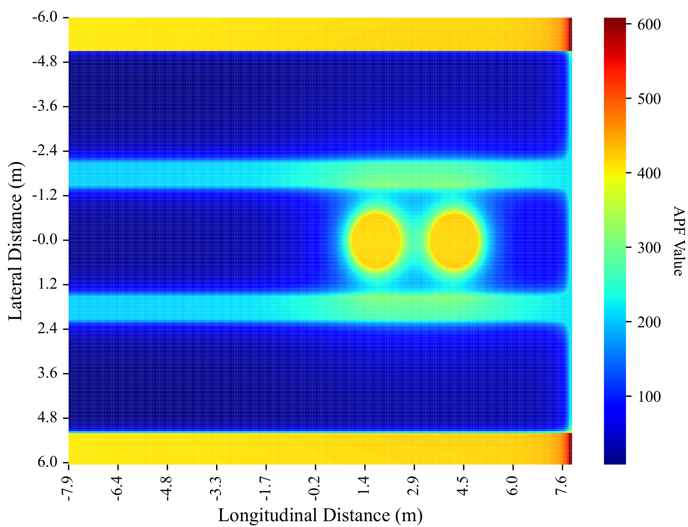

<html>
    <table style="width:100%;border:0px;border-spacing:0px;border-collapse:separate;margin-right:auto;margin-left:auto;">
          <tr onmouseout="nightsight_stop()" onmouseover="nightsight_start()">
            <td style="padding:20px;width:25%;vertical-align:middle;border-left-style:none;border-bottom-style:none;border-top-style:none;border-right-style:none">
              
            </td>
            <td style="padding:20px;width:75%;vertical-align:middle;border-left-style:none;border-bottom-style:none;border-top-style:none;border-right-style:none">
                <papertitle>Integrated Behavior Planning and Motion Control for Autonomous Vehicles with Traffic Rules Compliance
                </papertitle>
               
                <strong>Haichao Liu, Kai Chen</strong>, Yulin Li, Zhenmin Huang, Jianghua Duan, and Jun Ma
               
              <em>The 2023 IEEE International Conference on Robotics and Biomimetics (ROBIO).</em> 
              <a href="https://arxiv.org/pdf/2304.01041">arxiv</a> /
              <a href="https://github.com/HKUST-JM/Optimization-based-IDMC_CARLA">code</a>
            </td>
          </tr>
    </table>
</html>

## More Previous Publications Coming Soon!