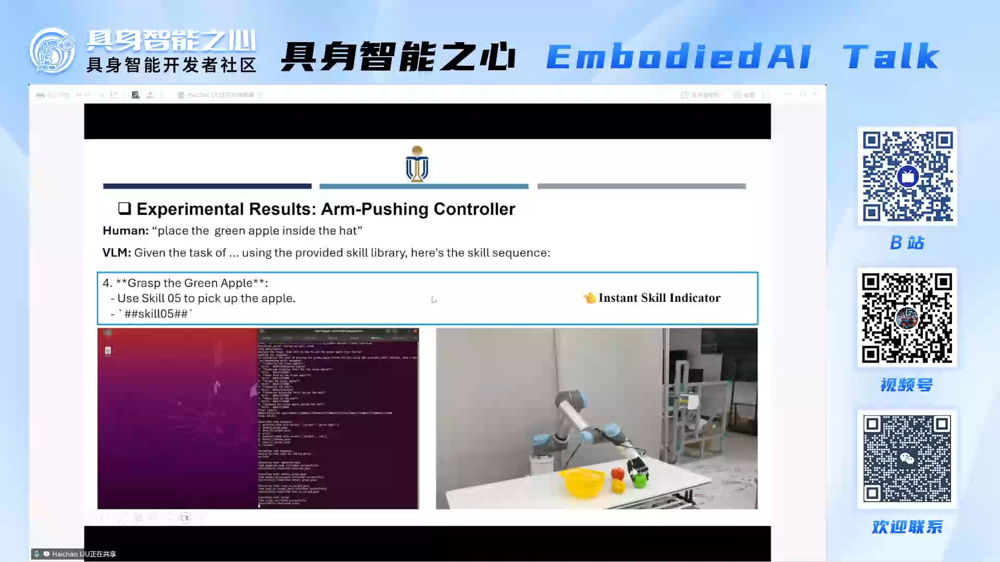

I was invited to give a talk at the **EmbodiedAI (具身智能之心) Online Live**. For more information, please refer to [Project Page](https://henryhcliu.github.io/robodexvlm/).

The video of the presentation is accessible at [Live Talk](https://drive.google.com/file/d/1Wv8vNvzByrGkQj1xzbdYLCDw1jwnzKyd/view?usp=drive_link).

The poster of the presentation is shown below:
